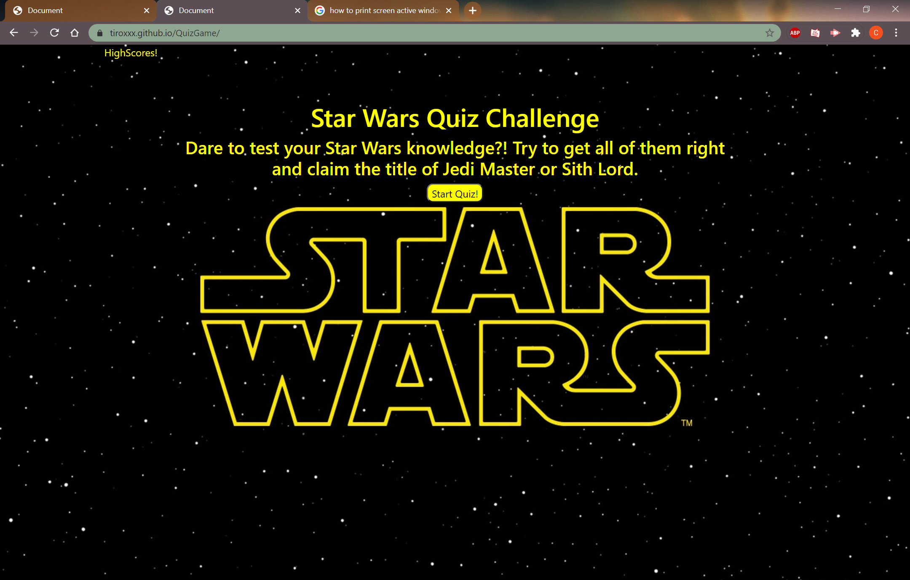

# QuizGame
https://tiroxxx.github.io/QuizGame/

## Technologies
Built with bootstrap

This application will quiz you on your star wars knowledge. Once the start quiz button is clicked, the quiz will start, asking the user 8 questions with 4 multiple choice answers. Upon completing the quiz or once the timer reaches 0, the application will prompt you for your initials and will submit them to the local storage. The highscore page will retrieve all the scores with the corresponging initials and put them on the leaderboard. I added a neat touch with music as you complete the quiz.

## License

Licensed under the [MIT License](LICENSE)

## Contact

email: christianmarquez41@gmail.com
